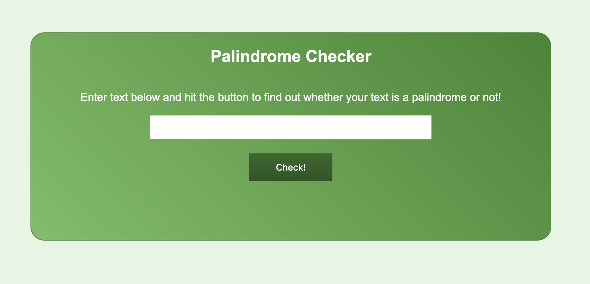

### Palindrome Checker

This project checks if the given input is a palindrome.

> A _palindrome_ is a word or phrase that can be read the same way forwards and backwards, ignoring punctuation, case, and spacing.

#### Using the Palindrome Checker

Enter the text you would like to check into the input field, then press the _Check!_ button.

#### Test Cases

The input `eye` should return `eye is a palindrome`.
The input `race car` should return `race car is a palindrome`.
The input `not a palindrome` should return `not a palindrome is not a palindrome`.
The input `A man, a plan, a canal. Panama` should return `A man, a plan, a canal. Panama is a palindrome`.

#### freeCodeCamp Disclaimer

This project was completed as part of [freeCodeCamp.org](https://www.freecodecamp.org)'s _JavaScript Algorithms and Data Structures_ course. This was a Certification Project, meaning [freeCodeCamp](https://www.freecodecamp.org) provided specifications and limited guidance and I was expected to code to meet certain test cases. The code presented here is my own.
